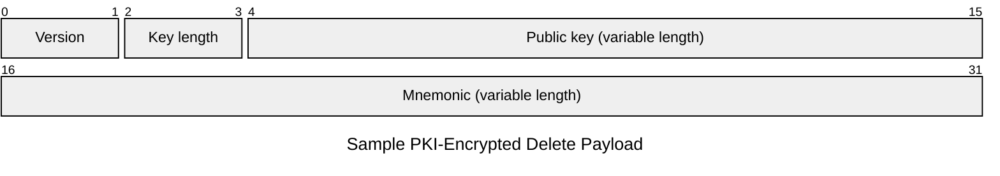
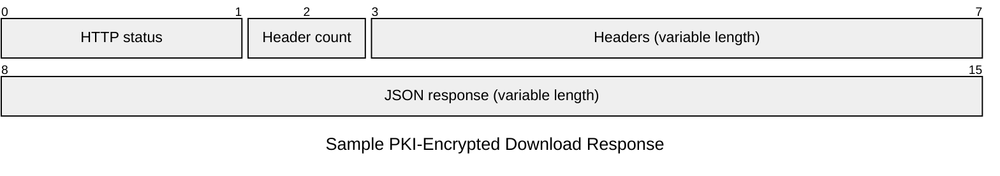

## Payload

### Fields

{}

{}

### Content type

#### multipart/form-data

When sending payloads without using [PKI](../pki), the `Content-Type` header must be set
to `multipart/form-data`.

#### application/octet-stream

Use the `Content-Type` header `application/octet-stream` when sending data using [PKI](../pki). After including the
required [PKI](../pki) components, the following byte format must be used.

Include the mnemonic encoded as UTF-8.



## Response

### Fields

{}

{}

### Content type

#### application/json

```json
{
	"success": true
}
```

#### application/octet-stream


